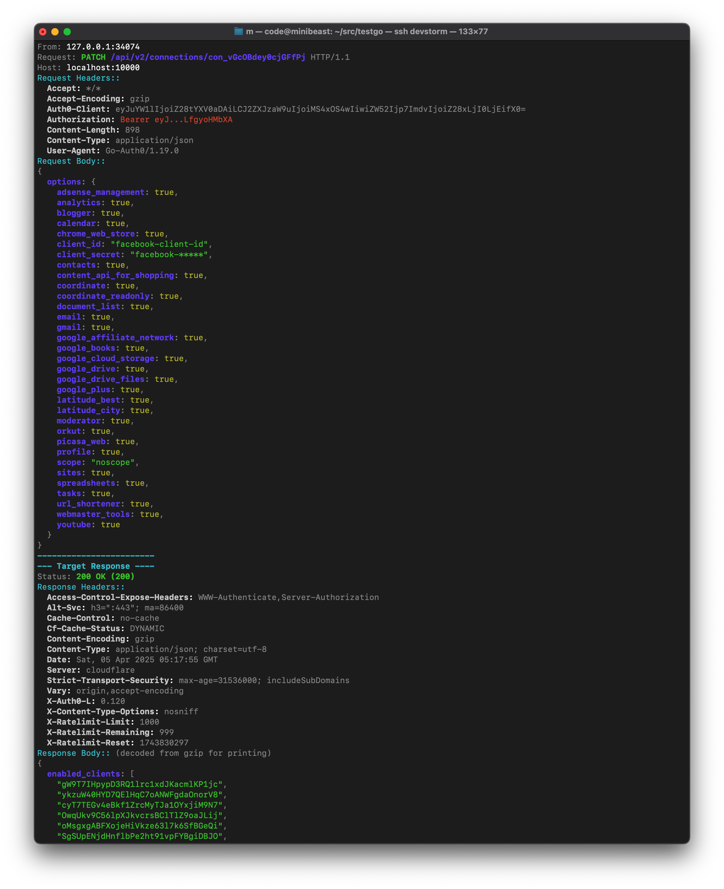

# Inspect HTTP Proxy

[](https://goreportcard.com/report/github.com/signeen/inspect-http-proxy)
[](https://www.gnu.org/licenses/gpl-3.0)

A simple yet powerful Go-based reverse HTTP proxy designed for detailed inspection of requests and responses. It logs traffic to the console with colorization, automatic decompression, and formatting for common content types, while remaining transparent to the client application.

Ideal for debugging API interactions, understanding middleware behavior, or simply getting a clear view of HTTP traffic flow.

## Key Features

*   **Simple Reverse HTTP Proxy:** Forwards traffic from a local port to a specified target URL.
*   **Detailed Console Logging:** Logs essential information for each request/response pair:
    *   Timestamp
    *   Client IP Address
    *   Request Method, URL (Path + Query), Protocol
    *   Request & Response Headers (with sensitive header omission/redaction)
    *   Request & Response Body
    *   Response Status Code & Status Text
    *   Request Duration
*   **Automatic Response Body Decompression (for Logging):** Automatically decompresses `gzip`, `br` (Brotli), and `deflate` encoded response bodies before logging, allowing you to see the actual content easily.
*   **Pretty-Printing & Colorization:**
    *   Formats and colorizes JSON request/response bodies for improved readability.
    *   Formats and colorizes `application/x-www-form-urlencoded` bodies.
    *   Color-codes status codes, methods, headers, and other log elements.
*   **Transparent Forwarding:** The proxy forwards the *original* response body (compressed or uncompressed) and headers received from the target server back to the client. Decompression/formatting is *only* for the console log.
*   **Configurable:**
    *   Set the listening address/port (`-listen`).
    *   Set the target server URL (`-target`).
    *   Optionally truncate the logged body output to a specific size (`-truncate-log-body`).
*   **Safe Logging:**
    *   Redacts the `Authorization` header value in logs.
    *   Omits common, noisy proxy/CDN headers from the log output by default.
*   **Correct Proxy Behavior:**
    *   Handles hop-by-hop headers correctly.
    *   Adds standard `X-Forwarded-For`, `X-Forwarded-Proto`, and `X-Forwarded-Host` headers to the request sent to the target.

## Installation

You can install the proxy directly using `go install`:

```bash
go install github.com/signeen/inspect-http-proxy@latest
```

Alternatively, you can clone the repository and build it manually:

```bash
git clone https://github.com/signeen/inspect-http-proxy.git
cd inspect-http-proxy
go build
```

## Usage

Run the proxy from your terminal, specifying the target URL.

```bash
inspect-http-proxy -target <target-url> [flags]
```

**Flags:**

*   `-listen <address:port>`: Address and port for the proxy to listen on. (Default: `:20003`)
*   `-target <url>`: URL of the target server to forward requests to. (Required, e.g., `http://localhost:8080`, `https://api.example.com`)
*   `-truncate-log-body`: If set, truncate the logged body output string to a predefined limit (currently 10KB). (Default: `false`)

**Examples:**

1.  **Proxy to a local backend API:**
    ```bash
    inspect-http-proxy -target http://localhost:8080
    ```
    Now send requests to `http://localhost:20003` instead of `http://localhost:8080`.

2.  **Listen on a different port and proxy to HTTPS:**
    ```bash
    inspect-http-proxy -listen :9999 -target https://jsonplaceholder.typicode.com
    ```
    Send requests to `http://localhost:9999`.

3.  **Proxy and truncate long log bodies:**
    ```bash
    inspect-http-proxy -target http://my-verbose-api:5000 -truncate-log-body
    ```

## Example Output

Here's a sample of what the console output might look like (colors omitted for basic Markdown):



```
--- Incoming Request ---
Time: 2025-04-04T10:30:01Z
From: 127.0.0.1:54321
Request: POST /api/v1/users HTTP/1.1
Host: localhost:20003
Query Parameters:
  source: web
Request Headers:
  Accept: application/json
  Accept-Encoding: gzip, deflate, br
  Authorization: [REDACTED SHORT]
  Content-Length: 55
  Content-Type: application/json
  User-Agent: curl/7.79.1
Request Body: (decoded from json for printing)
  {
    "email": "test@example.com",
    "name": "Test User"
  }
------------------------
--- Target Response ----
Status: 201 Created (201)
Response Headers:
  Content-Encoding: gzip
  Content-Type: application/json; charset=utf-8
  Date: Fri, 04 Apr 2025 10:30:01 GMT
  Location: /api/v1/users/123
  Server: Caddy
  Vary: Accept-Encoding
Response Body: (decoded from gzip for printing)
  {
    "id": "123",
    "message": "User created successfully",
    "timestamp": "2025-04-04T10:30:01.500Z"
  }
Duration: 55.123456ms
-----------------------
=======================

--- Incoming Request ---
Time: 2025-04-04T10:31:05Z
From: 127.0.0.1:54322
Request: GET /api/v1/items?limit=10 HTTP/1.1
Host: localhost:20003
Query Parameters:
  limit: 10
Request Headers:
  Accept: */*
  Accept-Encoding: gzip
  User-Agent: Wget/1.21.1
Request Body: (empty)
------------------------
--- Target Response ----
Status: 200 OK (200)
Response Headers:
  Content-Length: 25000
  Content-Type: application/json
  Date: Fri, 04 Apr 2025 10:31:05 GMT
  Server: nginx
Response Body: (decoded from json for printing)
  [
    {
      "id": "item1",
      "value": "..."
    },
    {
      "id": "item2",
      "value": "..."
    }
    // ... more items
  ]
  ... (Output truncated for display, original data size 25000 bytes)
Duration: 12.987654ms
-----------------------
=======================
```

## Contributing

Contributions are welcome! Please feel free to open an issue to report bugs or suggest features, or submit a pull request with improvements.

## License

This project is licensed under the GNU General Public License v3.0 - see the [LICENSE](LICENSE) file for details.

